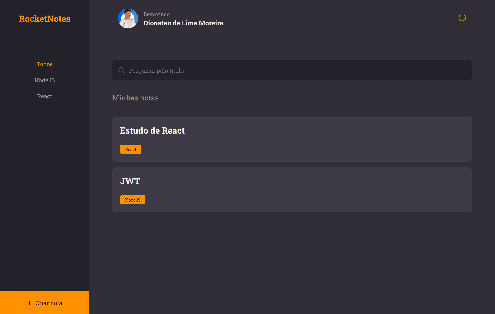
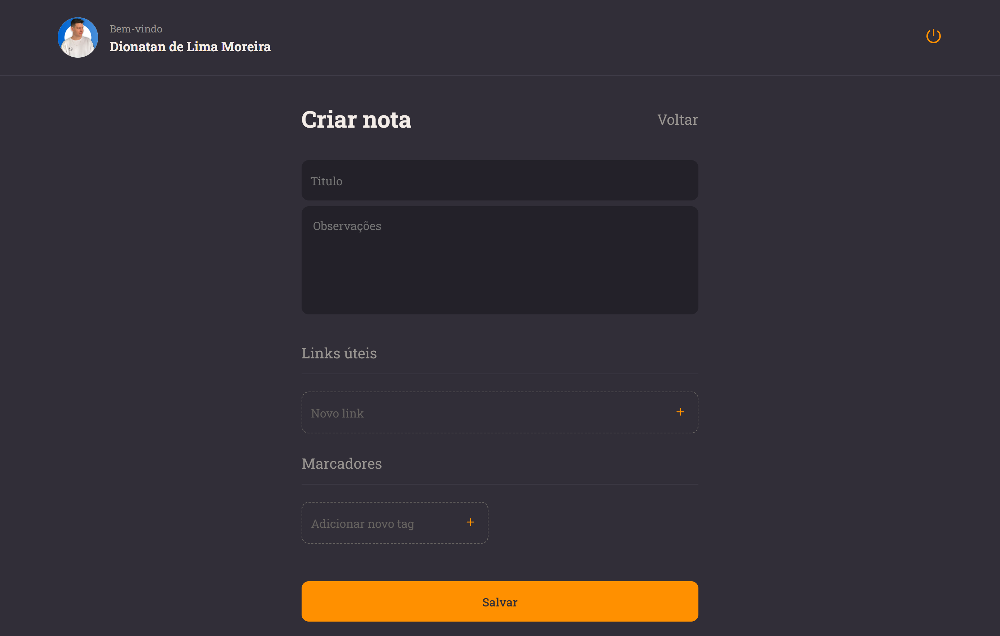
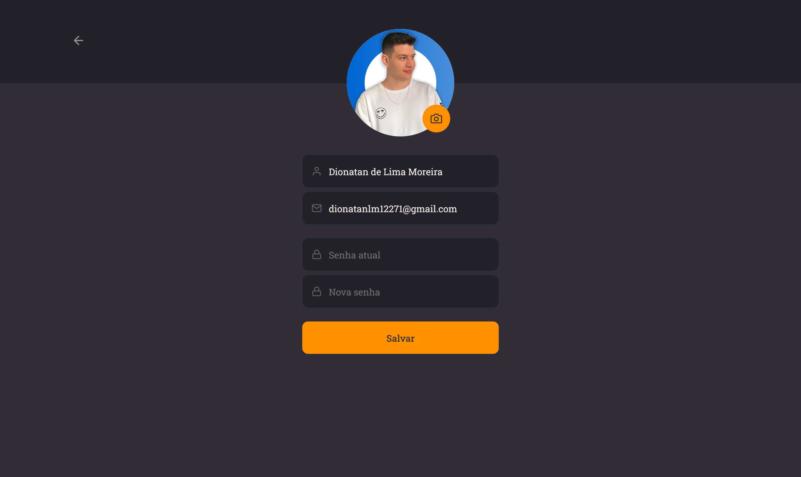

<h1 align="center">
  RocketNotes
</h1>

> O Rocketnotes é uma plataforma web que permite aos usuários registrarem-se e criarem anotações organizadas sobre assuntos específicos. Ela oferece recursos como a adição de títulos, descrições, links e tags para cada nota, garantindo uma estruturação eficiente. Além disso, os usuários têm a liberdade de personalizar seus perfis, alterando seu avatar, nome, e-mail e senha de forma fácil e rápida

Este projeto foi desenvolvido durante a trilha/curso Explorer oferecida pela Rocketseat.

## 🚀 Executar a aplicação
Você precisará do Node.js instalado no seu computador para iniciar este aplicativo.

```
git clone https://github.com/DionatanLM/RocketNotes.git
$ cd RocketNotes
$ npm install
$ npm run dev
```
Executar o aplicativo em modo de desenvolvimento


## 🛠️ Tecnologias

* FrontEnd: ReactJS, Javascript, Vite, Styled Components e Axios
* BackEnd: NodeJS e Express
* Banco de Dados: SQlite e Knex.js como Query Builder
* Deploy: Render e Netlify
> Link do prejeto no ar: https://luminous-griffin-db61f0.netlify.app/

## ⚙️ Funções

- [x] Sistema de autenticação
- [x] Criar uma conta
- [x] Criar uma nota
- [x] Excluir uma nota
- [x] Editar perfil


<p align="center">
  
  
  
  
  
  
</p>
